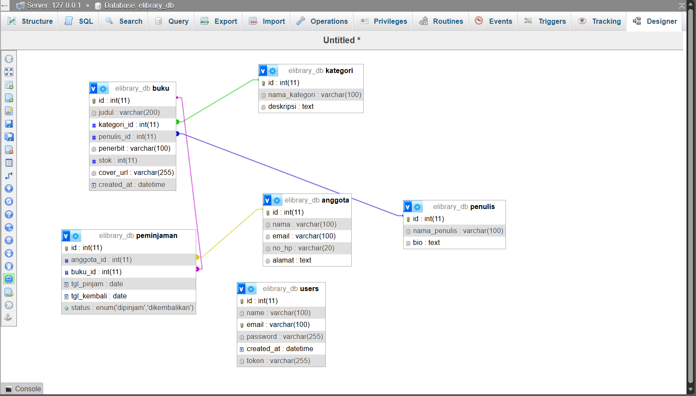
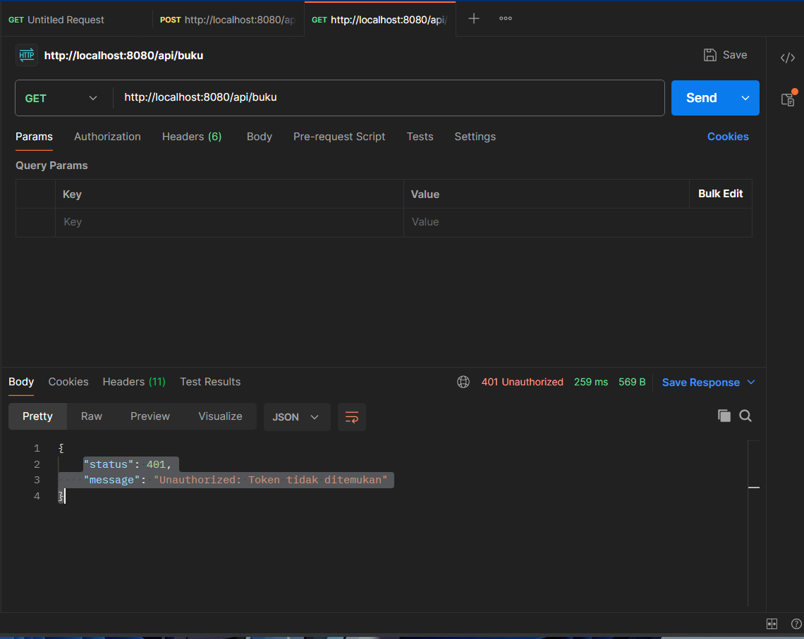
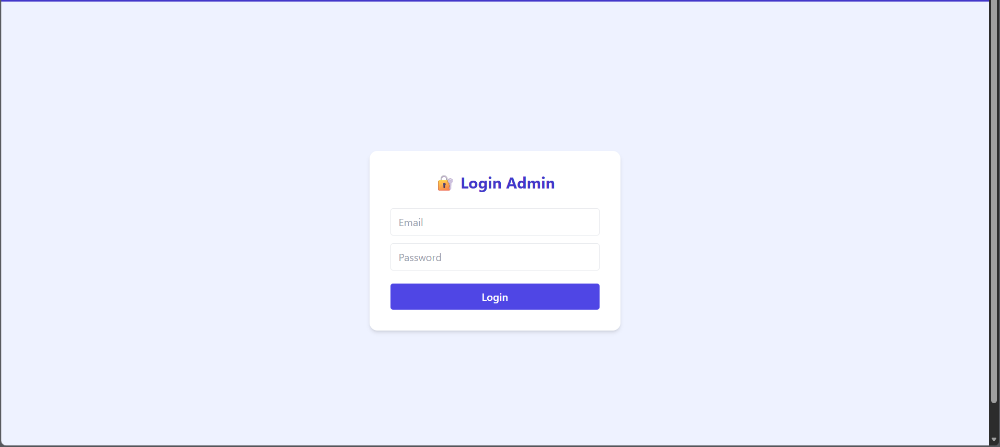
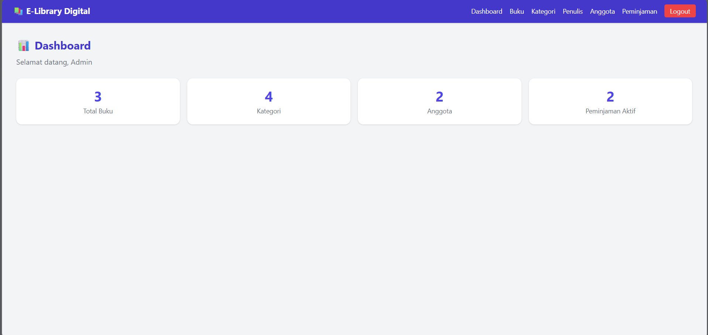
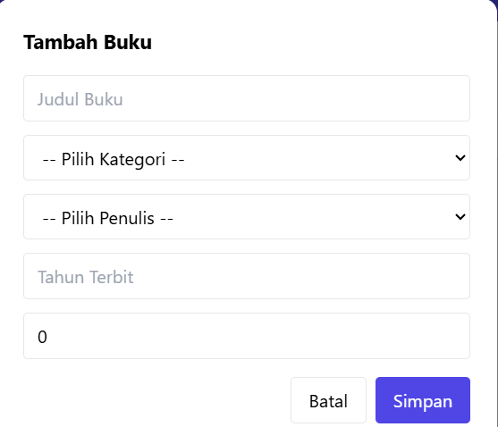
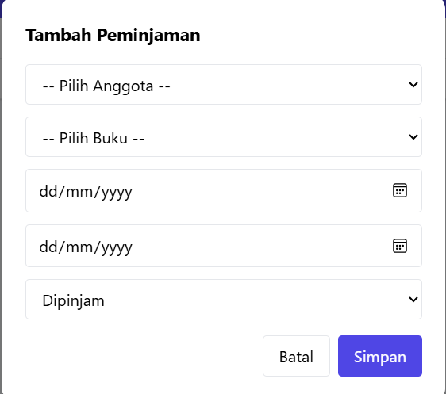
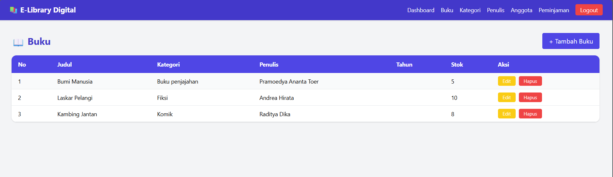
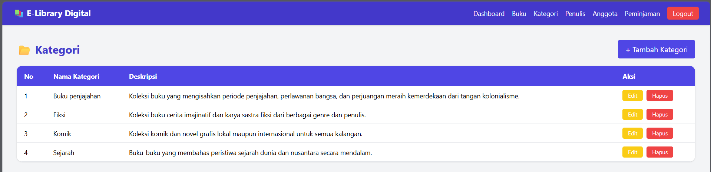
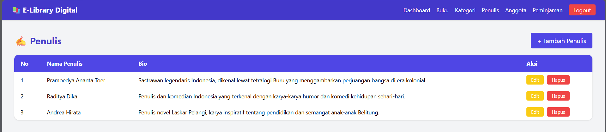

# UAS_Web2_312410151_AnandaFriezyEkaCahya

## 📚 E-Library Digital
Sistem Informasi Rental Buku & Komik Digital berbasis arsitektur decoupled (Backend API + Frontend SPA).

### Deskripsi
Aplikasi web modern untuk mengelola data buku, kategori genre, data penulis, status peminjaman, dan anggota perpustakaan digital. Dibangun menggunakan CodeIgniter 4 sebagai RESTful API Backend dan VueJS 3 sebagai Frontend Single Page Application.

---

## 🛠️ Teknologi yang Digunakan
- **Backend**: PHP CodeIgniter 4 (RESTful API)
- **Frontend**: VueJS 3 (CDN) + Vue Router
- **UI Framework**: TailwindCSS (CDN)
- **HTTP Client**: Axios
- **Database**: MySQL (XAMPP)
- **Auth**: Bearer Token via CI4 Filters

---

## 🗄️ Skema Relasi Tabel Database

---

## 🔐 Uji Coba API Proteksi Token (401 Unauthorized)

---

## 📸 Screenshot Antarmuka Aplikasi

### Halaman Login

### Halaman Dashboard Admin

### Form Modal Tambah Buku

### Form Modal Tambah Peminjaman

### Tabel Data Buku

### Tabel Data Kategori

### Tabel Data Penulis

---

## ⚙️ Petunjuk Instalasi

### Backend (CodeIgniter 4)
1. Clone repo ini
2. Masuk ke folder `backend-api`
3. Copy `.env.example` ke `.env`, sesuaikan konfigurasi database
4. Import file SQL ke MySQL
5. Jalankan server:

cd backend-api

C:\xampp\php\php.exe spark serve --host 127.0.0.1 --port 8080
### Frontend (VueJS SPA)
1. Masuk ke folder `frontend-spa`
2. Letakkan di `C:\xampp\htdocs\frontend-spa`
3. Buka browser: `http://localhost/frontend-spa`

### Akun Default
- **Email**: admin@elibrary.com
- **Password**: password

---

## 🔗 Link Demo & Presentasi
- **Demo**: http://localhost/frontend-spa
- **Video Presentasi**: *(link YouTube menyusul)*

---

## 👤 Identitas Mahasiswa
- **Nama**: Ananda Friezy Eka Cahya
- **NIM**: 312410151
- **Mata Kuliah**: Pemrograman Web 2
